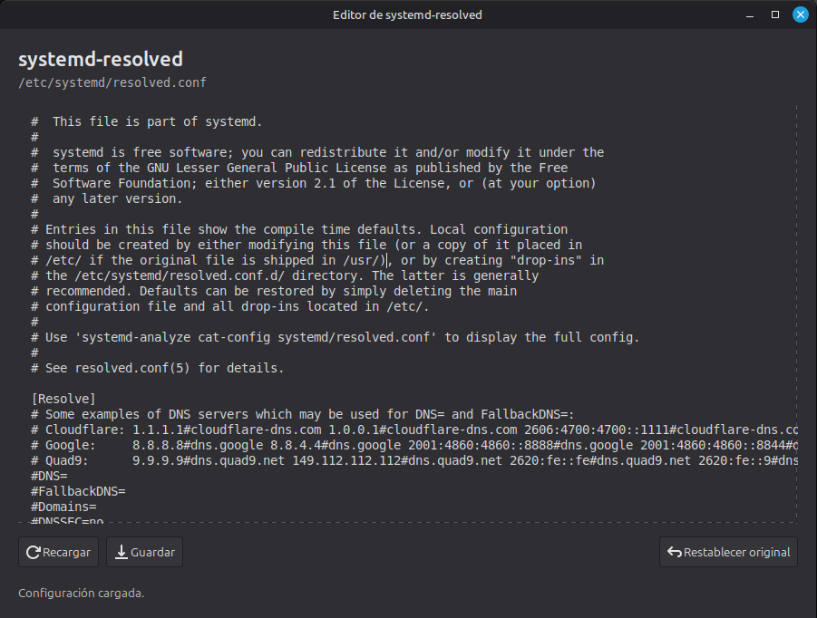

# systemd-resolved GUI

A small GTK 3 editor for `/etc/systemd/resolved.conf`. The application reads
the configuration as the current user and requests administrator authorization
only when saving or restoring it. The first launch records one restore point in
`~/.local/state/systemd-resolved-editor/`.


## Install using a .deb package

To install this application using a .deb package, you must download it from the Releases section or [click here](https://github.com/KebianOS/systemd-resolved-gui/releases/download/beta/systemd-resolved-gui_0.1.1-1_amd64.deb) to download the latest version.

### Preview in `Cinnamon`



## Run from the source tree

Requirements: Python 3, PyGObject with GTK 3, GNU gettext, and `pkexec` for
save/restore operations.

```sh
make run
```

The source strings are English. Spanish and French catalogs are in `po/`.
After editing a translatable string, update the template and catalogs, then
compile them with:

```sh
make update-translations
make translations
```

## Build a Debian package

Install the runtime dependencies declared in `debian/control`, plus `dpkg-dev`
and GNU gettext for building. Then run:

```sh
make build-deb
```

The package is written under `build/`. It includes the Python application,
desktop launcher, SVG icon, and compiled gettext catalogs. Python code is
installed as source; the `.deb` packages it rather than compiling it to native
machine code.

To install the local package on Debian 13 (including KDE Plasma) or Linux Mint,
build it first, then use APT so it can resolve the dependencies declared in
`debian/control`:

```sh
make build-deb
sudo apt install ./build/systemd-resolved-gui_0.1.1-1_amd64.deb
```

Saving and restoring use `pkexec`; KDE Plasma's PolicyKit authentication agent
must be active in the desktop session to show the authorization prompt.

The maintainer identity in `debian/control` and `debian/changelog` is a local
placeholder and should be replaced before publishing the package.

Saving changes the live system configuration and restarts `systemd-resolved`.
Restoring the initial file also restarts the service. Review the file carefully
before saving; the application does not validate systemd options.